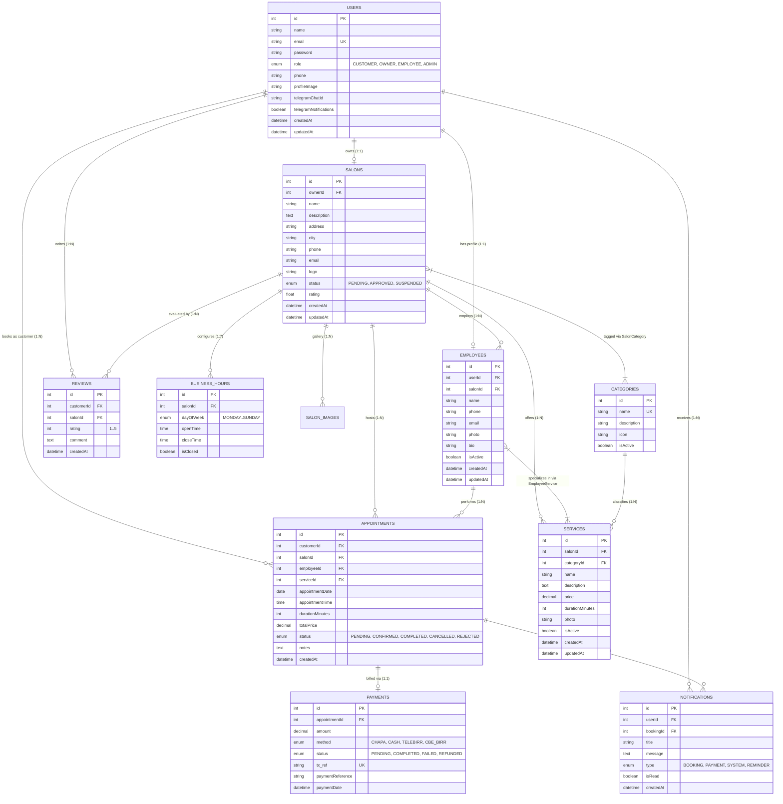

# 🗄️ Database Architecture & Data Dictionary

> **DBMS**: MySQL 8.0+  
> **ORM Engine**: Sequelize v6+  
> **Naming Standard**: camelCase attributes mapped to snake_case column keys  

---

## 1. Entity Relationship Diagram (ERD)

---

## 2. Table Specifications & Constraints

### 2.1 `Users`
Central account credentials and global role identity.
- `id`: INT (Auto Increment, Primary Key)
- `name`: VARCHAR(255), NOT NULL
- `email`: VARCHAR(255), UNIQUE, NOT NULL
- `password`: VARCHAR(255), NOT NULL (Bcrypt hashed)
- `role`: ENUM('CUSTOMER', 'OWNER', 'EMPLOYEE', 'ADMIN'), DEFAULT 'CUSTOMER'
- `phone`: VARCHAR(50), NULLABLE
- `profileImage`: VARCHAR(255), DEFAULT '/uploads/defaults/user.png'
- `telegramChatId`: VARCHAR(100), NULLABLE (Indexed)
- `telegramNotifications`: BOOLEAN, DEFAULT true

### 2.2 `Salons`
Registered salon entities and owner linkage.
- `id`: INT (Auto Increment, Primary Key)
- `ownerId`: INT, FOREIGN KEY (`Users.id`) ON DELETE CASCADE
- `name`: VARCHAR(255), NOT NULL
- `description`: TEXT, NULLABLE
- `address`: VARCHAR(255), NOT NULL
- `city`: VARCHAR(100), NOT NULL
- `phone`: VARCHAR(50), NOT NULL
- `email`: VARCHAR(100), NULLABLE
- `logo`: VARCHAR(255), NULLABLE
- `status`: ENUM('PENDING', 'APPROVED', 'SUSPENDED'), DEFAULT 'PENDING'
- `rating`: DECIMAL(3,2), DEFAULT 0.00

### 2.3 `Employees`
Staff members assigned to salons.
- `id`: INT (Auto Increment, Primary Key)
- `userId`: INT, FOREIGN KEY (`Users.id`) ON DELETE SET NULL
- `salonId`: INT, FOREIGN KEY (`Salons.id`) ON DELETE CASCADE
- `name`: VARCHAR(255), NOT NULL
- `phone`: VARCHAR(50), NULLABLE
- `email`: VARCHAR(100), NULLABLE
- `photo`: VARCHAR(255), NULLABLE
- `bio`: TEXT, NULLABLE
- `isActive`: BOOLEAN, DEFAULT true

### 2.4 `Services`
Service menu offered by salons with pricing and duration.
- `id`: INT (Auto Increment, Primary Key)
- `salonId`: INT, FOREIGN KEY (`Salons.id`) ON DELETE CASCADE
- `categoryId`: INT, FOREIGN KEY (`Categories.id`) ON DELETE SET NULL
- `name`: VARCHAR(255), NOT NULL
- `description`: TEXT, NULLABLE
- `price`: DECIMAL(10, 2), NOT NULL
- `durationMinutes`: INT, NOT NULL (e.g. 30, 45, 60, 90)
- `photo`: VARCHAR(255), NULLABLE
- `isActive`: BOOLEAN, DEFAULT true

### 2.5 `Appointments`
Booking orders placed by customers.
- `id`: INT (Auto Increment, Primary Key)
- `customerId`: INT, FOREIGN KEY (`Users.id`) ON DELETE CASCADE
- `salonId`: INT, FOREIGN KEY (`Salons.id`) ON DELETE CASCADE
- `employeeId`: INT, FOREIGN KEY (`Employees.id`) ON DELETE RESTRICT
- `serviceId`: INT, FOREIGN KEY (`Services.id`) ON DELETE RESTRICT
- `appointmentDate`: DATE, NOT NULL
- `appointmentTime`: TIME, NOT NULL
- `durationMinutes`: INT, NOT NULL
- `totalPrice`: DECIMAL(10, 2), NOT NULL
- `status`: ENUM('PENDING', 'CONFIRMED', 'COMPLETED', 'CANCELLED', 'REJECTED'), DEFAULT 'PENDING'
- `notes`: TEXT, NULLABLE

### 2.6 `Payments`
Financial transactions and gateway references.
- `id`: INT (Auto Increment, Primary Key)
- `appointmentId`: INT, FOREIGN KEY (`Appointments.id`) ON DELETE CASCADE
- `amount`: DECIMAL(10, 2), NOT NULL
- `method`: ENUM('CHAPA', 'CASH', 'TELEBIRR', 'CBE_BIRR'), DEFAULT 'CHAPA'
- `status`: ENUM('PENDING', 'COMPLETED', 'FAILED', 'REFUNDED'), DEFAULT 'PENDING'
- `tx_ref`: VARCHAR(255), UNIQUE, NOT NULL
- `paymentReference`: VARCHAR(255), NULLABLE

---

## 3. Indexing & Optimization Strategy
1. **Unique Lookups**: `Users(email)`, `Payments(tx_ref)`, `Categories(name)`.
2. **Booking Slot Queries**: Composite index on `Appointments(salonId, employeeId, appointmentDate, status)` ensures sub-millisecond slot conflict lookups.
3. **Foreign Key Integrity**: Cascades configured to cleanly remove child records when salons or owners are purged, while protecting historical transactional ledgers (`RESTRICT` on appointment services and employees).
