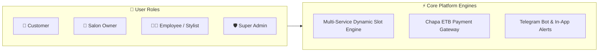

# 📚 Salon Platform — Master Documentation Hub

Welcome to the centralized documentation portal for the **Salon Platform**, a full-stack multi-tenant web application for discovering beauty salons, managing salon operations, booking multi-service appointments, and processing online payments.

---

## 📑 Documentation Directory

| Document | Description | Target Audience |
| :--- | :--- | :--- |
| [**1. System Architecture & Technical Specifications**](./SYSTEM_ARCHITECTURE_AND_SPECS.md) | High-level system architecture, multi-service slot allocation algorithms, security layer, and Telegram notification pipeline. | Architects, Lead Developers, Tech Reviewers |
| [**2. REST API Reference & Specification**](./API_DOCUMENTATION.md) | Complete endpoints, request/response JSON schemas, authorization headers, and error codes. | Backend & Frontend Developers, API Consumers |
| [**3. Database Architecture & Data Dictionary**](./DATABASE_SCHEMA.md) | Relational ERD diagram, table schemas, primary/foreign key constraints, and indexing strategy. | Database Admins, Backend Engineers |
| [**4. Visual User Manual & Interface Guide**](./VISUAL_USER_GUIDE_AND_SCREENSHOTS.md) | Comprehensive step-by-step UI walkthroughs with screen layouts and user journeys for all 4 roles. | End Users, QA Testers, Product Managers |
| [**5. Deployment & Configuration Guide**](./DEPLOYMENT_AND_SETUP_GUIDE.md) | Environment setup, MySQL setup, Chapa payment gateway, Telegram Bot, Google OAuth, and Nginx/PM2 deployment. | DevOps, System Administrators, Developers |
| [**6. Project Requirements & Scope**](./project-requirement.md) | Detailed functional and non-functional requirements specification. | Project Stakeholders, Business Analysts |

---

## 🌟 Key Platform Highlights

- **Multi-Service Cart & Contiguous Booking**: Customers can pick multiple services in one booking; the engine computes cumulative service duration and matches contiguous open slots.
- **Role-Based Workspaces**: Distinct dashboards tailored for Customers, Salon Owners, Employees, and Platform Admins.
- **Fintech & Payment Integration**: Seamless local Ethiopian Birr transactions via Chapa payment gateway.
- **Omnichannel Alerts**: In-app bell notifications and real-time Telegram bot push messages.
- **Modern Clean Tech Stack**: React 18, Vite, Node.js, Express, Sequelize ORM, MySQL.
