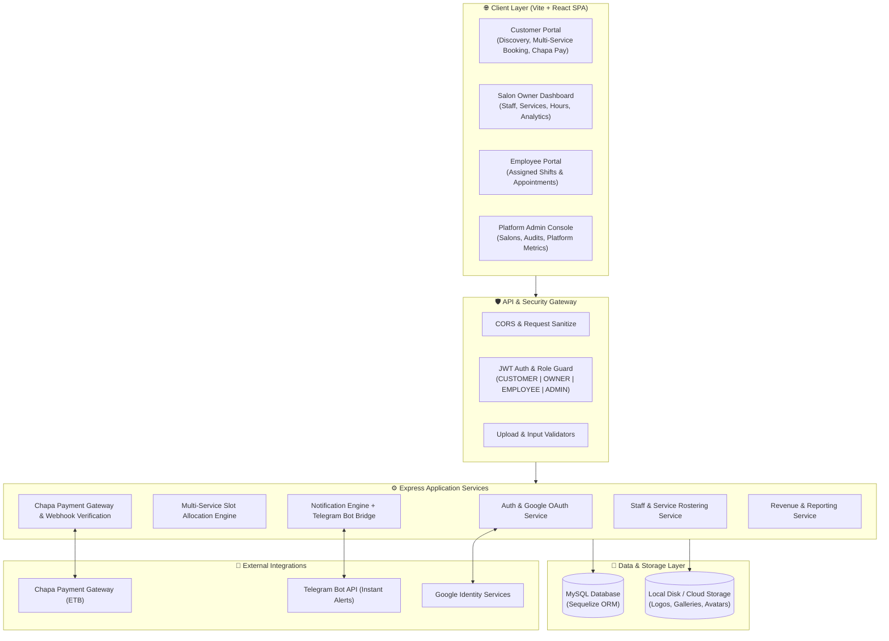
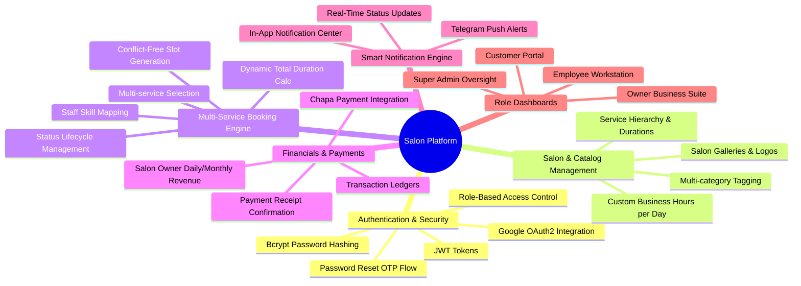
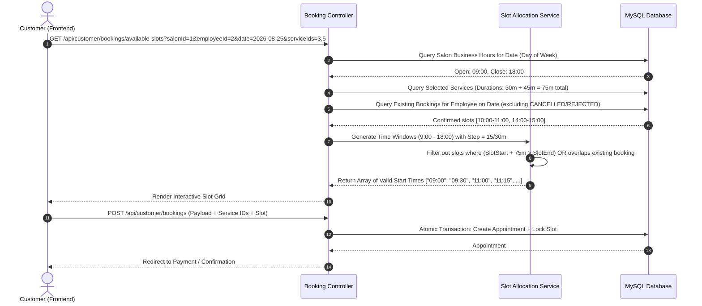
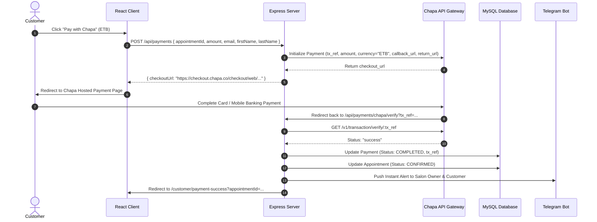
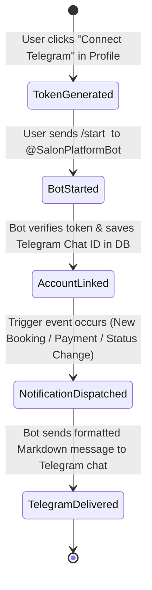

# 🏛️ System Architecture & Technical Specifications

> **Salon Platform** — Enterprise Full-Stack Multi-Tenant Beauty & Wellness Booking Ecosystem

---

## 1. System Architecture Overview

The Salon Platform is built upon a modern, decoupled client-server architecture with a 3-tier structure:
1. **Presentation Layer (Frontend)**: React 18 SPA powered by Vite, Tailwind/Modular CSS, and React Router.
2. **Application / Business Logic Layer (Backend)**: Node.js with Express RESTful API, JWT Role-Based Authorization, Multer media pipeline, and Telegram bot notification bridge.
3. **Data Layer (Database & Storage)**: MySQL relational database with Sequelize ORM, connection pooling, and structured static asset storage.

---

## 2. Core Functional Modules

---

## 3. Multi-Role Access Control Matrix

| Feature / Action | Guest | Customer | Salon Owner | Employee | Admin |
| :--- | :---: | :---: | :---: | :---: | :---: |
| **Browse Salons & Services** | ✅ | ✅ | ✅ | ✅ | ✅ |
| **Search & Filter Salons** | ✅ | ✅ | ✅ | ✅ | ✅ |
| **Register Account (Self)** | ✅ | ✅ | ❌ (Admin created) | ❌ (Owner created) | ❌ |
| **Book Multi-Service Appointments**| ❌ | ✅ | ❌ | ❌ | ❌ |
| **Cancel Own Booking** | ❌ | ✅ (Pending only) | ❌ | ❌ | ✅ |
| **Pay via Chapa Gateway** | ❌ | ✅ | ❌ | ❌ | ❌ |
| **Manage Salon Profile & Hours** | ❌ | ❌ | ✅ (Own salon) | ❌ | ✅ (All) |
| **Add / Edit / Remove Staff** | ❌ | ❌ | ✅ (Own salon) | ❌ | ❌ |
| **Assign Services to Staff** | ❌ | ❌ | ✅ (Own salon) | ❌ | ❌ |
| **Accept / Reject Bookings** | ❌ | ❌ | ✅ | ✅ (Assigned) | ❌ |
| **Mark Booking Completed** | ❌ | ❌ | ✅ | ✅ (Assigned) | ❌ |
| **View Revenue & Financial Analytics**| ❌ | ❌ | ✅ (Own salon) | ❌ | ✅ (Platform) |
| **Approve / Suspend Salons** | ❌ | ❌ | ❌ | ❌ | ✅ |
| **Manage Global Service Categories**| ❌ | ❌ | ❌ | ❌ | ✅ |
| **Link Telegram for Notifications** | ❌ | ✅ | ✅ | ✅ | ✅ |

---

## 4. Multi-Service Booking & Slot Allocation Algorithm

The platform features a slot calculation algorithm capable of booking multiple services in a single contiguous block.

### Workflow Sequence:

---

## 5. Payment & Transaction Flow (Chapa Gateway)

---

## 6. Telegram Instant Notification Pipeline

Users can connect their Telegram account directly to their Salon Platform profile via a 6-digit cryptographic OTP token or a deep link.

### Event Notification Triggers:
1. **`BOOKING_CREATED`**: Sent to Customer (Pending Confirmation) & Salon Owner (New Order alert).
2. **`BOOKING_ACCEPTED`**: Sent to Customer & Assigned Employee with calendar slot details.
3. **`BOOKING_REJECTED`**: Sent to Customer with explanation reason.
4. **`PAYMENT_SUCCESSFUL`**: Sent to Customer (receipt) & Salon Owner (revenue credit alert).
5. **`BOOKING_COMPLETED`**: Sent to Customer (inviting review) & Salon Owner.

---

## 7. Security & Compliance Implementation

- **Data Protection**: Passwords securely hashed with `bcryptjs` with salt round factor 10.
- **Stateless Authorization**: Signed JSON Web Tokens (JWT) containing userId, email, and role claims with strict expiration.
- **Route Protections**: Dual middleware layers (`protect` verifying bearer token integrity + `authorize(...roles)` enforcing granular least-privilege RBAC).
- **File Upload Security**: Multer with file mime-type checking (JPEG, PNG, WebP only) and strict file size limits (5MB max).
- **Input Validation**: Dedicated validator middlewares sanitizing and rejecting malformed payloads before database transactions.
- **Relational Integrity**: Foreign key constraints with cascading deletes for salons/business hours and restricted deletes for historical appointments.
