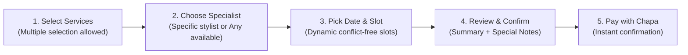

# 📸 Visual User Manual & Interface Guide

> Complete UI/UX walkthrough and screen layout guide for **Customers, Salon Owners, Employees, and Platform Administrators**.

---

## Table of Contents
1. [Public & Guest Experience](#1-public--guest-experience)
   - 1.1 Home / Landing Page
   - 1.2 Salon Exploration & Search
   - 1.3 Salon Profile & Details View
2. [Customer Journey & Booking Flow](#2-customer-journey--booking-flow)
   - 2.1 Multi-Service Selection
   - 2.2 Time Slot Picker & Staff Selection
   - 2.3 Chapa Secure Checkout & Receipt
   - 2.4 Customer Dashboard & Appointment Manager
3. [Salon Owner Business Suite](#3-salon-owner-business-suite)
   - 3.1 Owner Analytics Dashboard
   - 3.2 Staff Management & Service Assignment
   - 3.3 Services & Pricing Catalog
   - 3.4 Business Hours & Gallery Editor
   - 3.5 Financial Ledger & Transactions
4. [Employee Workstation](#4-employee-workstation)
   - 4.1 Daily Schedule & Assigned Appointments
   - 4.2 Booking Actions (Accept / Reject / Complete)
5. [Platform Super Admin Console](#5-platform-super-admin-console)
   - 5.1 System Overview & Platform Health
   - 5.2 Salon Approval & Verification
   - 5.3 Global Categories & Taxonomies
6. [Notification Center & Telegram Bot Integration](#6-notification-center--telegram-bot-integration)

---

## 1. Public & Guest Experience

### 1.1 Home / Landing Page (`/`)
The landing page greets visitors with a modern hero section, search bar, top-rated salons carousel, categories overview, and CTA buttons.

```text
+-----------------------------------------------------------------------------------+
|  [LOGO] SalonPlatform        Home   Salons   About   Contact     [Login] [Register]|
+-----------------------------------------------------------------------------------+
|                                                                                   |
|      ✨ Discover & Book The Best Salons Near You                                  |
|      Find top stylists, book appointments instantly, and pay securely.           |
|                                                                                   |
|      +-------------------------+--------------------+-------------------------+  |
|      | 🔍 Search salon, city... | All Categories  v | [ Find Salons ]         |  |
|      +-------------------------+--------------------+-------------------------+  |
|                                                                                   |
+-----------------------------------------------------------------------------------+
|  🏷️ Featured Categories: [ ✂️ Hair Care ] [ 💅 Nail Art ] [ 💆 Spa & Massage ]    |
+-----------------------------------------------------------------------------------+
|  🌟 Top Rated Salons                                                             |
|  +--------------------+  +--------------------+  +--------------------+           |
|  | [Salon Image 1]    |  | [Salon Image 2]    |  | [Salon Image 3]    |           |
|  | Luxe Glamour Studio|  | Royal Barber Lounge|  | Blossom Beauty Spa |           |
|  | ⭐ 4.9 (120 reviews)|  | ⭐ 4.8 (85 reviews)|  | ⭐ 4.9 (210 reviews)|          |
|  | 📍 Bole, Addis     |  | 📍 Kazanchis, Addis|  | 📍 Sarbet, Addis   |           |
|  | [ View Services ]  |  | [ View Services ]  |  | [ View Services ]  |           |
|  +--------------------+  +--------------------+  +--------------------+           |
+-----------------------------------------------------------------------------------+
```

---

### 1.2 Salon Profile & Details View (`/salons/:id`)
Comprehensive salon view showcasing logo, banner, photo gallery, business hours table, service catalog grouped by category, and direct booking triggers.

```text
+-----------------------------------------------------------------------------------+
|  <- Back to Salons                                                                |
|  +-----------------------------------------------------------------------------+  |
|  | [SALON BANNER & GALLERY PREVIEW (4 Photos)]                                 |  |
|  +-----------------------------------------------------------------------------+  |
|  | [LOGO] Luxe Glamour Studio              ⭐ 4.9 (124 reviews) | 📍 Bole, Addis |  |
|  | "Award-winning hair styling, coloring, and holistic skincare spa treatments"|  |
|  +-----------------------------------------------------------------------------+  |
|                                                                                   |
|  [ Services Menu ]       [ Staff / Specialists ]       [ Business Hours ]         |
|  -------------------------------------------------------------------------------  |
|  ✂️ Hair Care                                                                     |
|  +-----------------------------------------------------------------------------+  |
|  | Signature Haircut & Blowdry       | 45 mins | 450 ETB | [ + Select for Book]|  |
|  | Keratin Smoothing Treatment       | 90 mins | 1,800 ETB| [ + Select for Book]|  |
|  +-----------------------------------------------------------------------------+  |
|  💅 Nail Art & Spa                                                                |
|  +-----------------------------------------------------------------------------+  |
|  | Deluxe Gel Manicure               | 40 mins | 350 ETB | [ + Select for Book]|  |
|  | Aromatherapy Pedicure             | 50 mins | 500 ETB | [ + Select for Book]|  |
|  +-----------------------------------------------------------------------------+  |
|                                                                                   |
|                                     [ Selected: 2 Services (85 mins, 800 ETB) -> ]|
+-----------------------------------------------------------------------------------+
```

---

## 2. Customer Journey & Booking Flow

### 2.1 Interactive Booking Wizard (`/customer/booking`)



#### Step-by-Step UI Layout:

```text
+-----------------------------------------------------------------------------------+
|  📅 BOOK YOUR APPOINTMENT — Luxe Glamour Studio                                    |
|  Step 1: Services  ->  [Step 2: Specialist]  ->  Step 3: Slot  ->  Step 4: Pay   |
+-----------------------------------------------------------------------------------+
|                                                                                   |
|  Select Stylist / Specialist:                                                     |
|  +--------------------+  +--------------------+  +--------------------+           |
|  | (•) ANY SPECIALIST |  | ( ) Saron Tefera   |  | ( ) Dawit Bekele   |           |
|  | [Fastest Available]|  | Senior Hair Stylist|  | Nail & Spa Expert  |           |
|  +--------------------+  +--------------------+  +--------------------+           |
|                                                                                   |
|  Select Date: [ 2026-08-25 ] < Tuesday >                                          |
|                                                                                   |
|  Available Time Slots (Total Service Duration: 85 mins):                          |
|  +--------+  +--------+  +--------+  +--------+  +--------+                       |
|  | 09:00  |  | 09:45  |  | 11:15  |  | 14:00  |  | 15:30  |                       |
|  +--------+  +--------+  +--------+  +--------+  +--------+                       |
|                                                                                   |
|  Order Summary:                                                                   |
|  - Signature Haircut (45 min) ................. 450 ETB                           |
|  - Deluxe Gel Manicure (40 min) ............... 350 ETB                           |
|  ------------------------------------------------------                           |
|  Total: 85 mins | Total Due: 800.00 ETB                                           |
|                                                                                   |
|  [ <- Back ]                                  [ Proceed to Checkout (800 ETB) -> ]|
+-----------------------------------------------------------------------------------+
```

---

### 2.2 Chapa Hosted Checkout & Payment Success (`/customer/payment-success`)

```text
+-----------------------------------------------------------------------------------+
|                             ✅ PAYMENT SUCCESSFUL!                                |
|                                                                                   |
|             Your appointment has been confirmed at Luxe Glamour Studio.           |
|                                                                                   |
|    +-----------------------------------------------------------------------+      |
|    |  Receipt Reference : SALON-TX-1740312000-88                           |      |
|    |  Appointment Date  : Tuesday, Aug 25, 2026 at 11:15 AM                |      |
|    |  Specialist        : Saron Tefera                                     |      |
|    |  Amount Paid       : 800.00 ETB (Chapa Payment Gateway)               |      |
|    |  Status            : CONFIRMED                                        |      |
|    +-----------------------------------------------------------------------+      |
|                                                                                   |
|    📲 A confirmation notification and Telegram alert have been dispatched.        |
|                                                                                   |
|             [ View My Appointments ]       [ Back to Home ]                       |
+-----------------------------------------------------------------------------------+
```

---

## 3. Salon Owner Business Suite

### 3.1 Owner Analytics Dashboard (`/owner/dashboard`)

```text
+-----------------------------------------------------------------------------------+
|  [LOGO] Salon Studio       Dashboard   Bookings   Services   Staff   Transactions |
+-----------------------------------------------------------------------------------+
|  👋 Welcome back, Owner! Here's your salon overview for today:                    |
|                                                                                   |
|  +--------------------+  +--------------------+  +--------------------+           |
|  | 💰 Today's Revenue |  | 📅 Today's Bookings|  | ⭐ Average Rating  |           |
|  |   4,250.00 ETB     |  |   8 Appointments   |  |   4.9 / 5.0 (124)  |           |
|  +--------------------+  +--------------------+  +--------------------+           |
|                                                                                   |
|  📋 Incoming Appointment Requests (Requires Attention):                          |
|  +-----------------------------------------------------------------------------+  |
|  | Customer       | Services               | Time     | Staff  | Actions       |  |
|  |----------------|------------------------|----------|--------|---------------|  |
|  | Helen M.       | Haircut + Blowdry      | 10:00 AM | Saron  | [Accept][Reject]|
|  | Michael K.     | Beard Grooming         | 11:30 AM | Dawit  | [Accept][Reject]|
|  +-----------------------------------------------------------------------------+  |
|                                                                                   |
|  📈 Monthly Revenue Trend                                                         |
|  [========================================= 78,400 ETB in August ]                |
+-----------------------------------------------------------------------------------+
```

---

### 3.2 Staff Management & Service Mapping (`/owner/employees`)

Salon owners can:
1. Create new staff member profiles.
2. Upload professional staff photos.
3. Map specific services from the salon catalog to staff specializations.

```text
+-----------------------------------------------------------------------------------+
|  👥 Salon Employees & Specialists                     [ + Add New Employee ]      |
+-----------------------------------------------------------------------------------+
|  +-----------------------------------------------------------------------------+  |
|  | [PHOTO] Saron Tefera — Senior Stylist                                       |  |
|  | Phone: +251911334455 | Email: saron@salon.com | Status: [ Active ]          |  |
|  | Assigned Services (4): Haircut, Blowdry, Keratin, Coloring                  |  |
|  | [ Edit Profile ]   [ Map Services ]   [ Upload Photo ]   [ Remove ]         |  |
|  +-----------------------------------------------------------------------------+  |
|  | [PHOTO] Dawit Bekele — Nail Artist & Spa Specialist                         |  |
|  | Phone: +251922110044 | Email: dawit@salon.com | Status: [ Active ]          |  |
|  | Assigned Services (3): Gel Manicure, Pedicure, Facial Cleanse               |  |
|  | [ Edit Profile ]   [ Map Services ]   [ Upload Photo ]   [ Remove ]         |  |
|  +-----------------------------------------------------------------------------+  |
+-----------------------------------------------------------------------------------+
```

---

## 4. Employee Workstation (`/employee/dashboard`)

```text
+-----------------------------------------------------------------------------------+
|  👩‍💼 Employee Portal — Saron Tefera                         [ Notifications (2) ]  |
+-----------------------------------------------------------------------------------+
|  📅 Your Assigned Schedule for Today (Aug 25, 2026)                               |
|                                                                                   |
|  +-----------------------------------------------------------------------------+  |
|  | ⏰ 09:00 - 09:45 AM | Customer: Helen M.                                    |  |
|  | Service: Signature Haircut & Blowdry                                        |  |
|  | Notes: Sensitive scalp, use mild organic shampoo.                           |  |
|  | Status: [ CONFIRMED ]              Action: [ Mark as Completed ]            |  |
|  +-----------------------------------------------------------------------------+  |
|  | ⏰ 11:15 - 12:40 PM | Customer: Jane Doe                                    |  |
|  | Service: Keratin Smoothing Treatment                                        |  |
|  | Status: [ CONFIRMED ]              Action: [ Mark as Completed ]            |  |
|  +-----------------------------------------------------------------------------+  |
+-----------------------------------------------------------------------------------+
```

---

## 5. Platform Super Admin Console (`/admin/dashboard`)

```text
+-----------------------------------------------------------------------------------+
|  🛡️ Super Administrator Console                        Logged in as: SuperAdmin  |
+-----------------------------------------------------------------------------------+
|  [ Salons Management ]  [ Categories ]  [ All Bookings ]  [ Financial Reports ]   |
+-----------------------------------------------------------------------------------+
|  Platform KPI Summary:                                                            |
|  - Registered Salons: 48 (42 Approved, 4 Pending Review, 2 Suspended)             |
|  - Total Platform Volume: 342,000.00 ETB (Month-to-Date)                          |
|  - Active Users: 3,410 Customers | 185 Staff Specialists                         |
|                                                                                   |
|  🏢 Pending Salon Approvals:                                                      |
|  +-----------------------------------------------------------------------------+  |
|  | Salon Name            | Owner           | City    | Docs | Actions          |  |
|  |-----------------------|-----------------|---------|------|------------------|  |
|  | Elegance Lounge Addis | Tigist Assefa   | Addis   | [PDF]| [Approve][Reject]|  |
|  | Blue Nile Barbershop  | Yonas Girma     | Bahir D | [PDF]| [Approve][Reject]|  |
|  +-----------------------------------------------------------------------------+  |
+-----------------------------------------------------------------------------------+
```

---

## 6. Notification Center & Telegram Bot Integration

### 6.1 Connecting Telegram via One-Click Link

```text
+-----------------------------------------------------------------------------------+
|  🔔 Instant Notification Settings                                                 |
+-----------------------------------------------------------------------------------+
|  Receive instant push notifications for new bookings, confirmations & payments!   |
|                                                                                   |
|  Status: [ ⚠️ Not Connected ]                                                     |
|                                                                                   |
|  Step 1: Open Telegram and search for: @SalonPlatformBot                          |
|  Step 2: Press Start and send your one-time linking token:                        |
|                                                                                   |
|             +-----------------------------------------------+                     |
|             |               SLN-892-019                     |  [ Copy Token ]     |
|             +-----------------------------------------------+                     |
|                                                                                   |
|  Or Click Direct Link: [ 🚀 Open Telegram Bot Directly ]                          |
+-----------------------------------------------------------------------------------+
```
